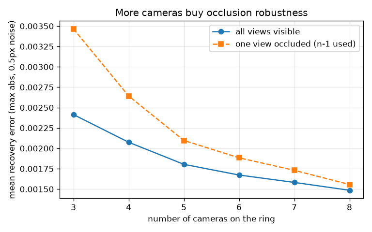

# multicam-occlusion

[](https://github.com/bamdadd/multicam-occlusion/actions/workflows/ci.yml)
[](LICENSE)

> **How much does a second or third camera actually buy you when an object is
> occluded in one view?**

When a point is hidden in one camera, a single view can never recover its 3D
position — one image constrains the point only to a viewing ray, so its depth
is unobservable. Add a second calibrated camera and the rays intersect: the
point is recovered exactly. Add more, and the estimate stops caring that any one
view was lost to occlusion. **This benchmark measures that trade-off** — how
single-view recovery fails, how multi-view recovery succeeds, and how recovery
error under realistic pixel noise falls as you add cameras.



*With 0.5px Gaussian pixel noise: more cameras over-determine the triangulation
and drive error down, and the cost of losing one view to occlusion (dashed)
shrinks toward zero as the ring grows. Regenerate with
`uv run python docs/plot_recovery_vs_views.py`.*

## Hero: single view fails, multi-view recovers the occluded point

Project one known 3D point into six synthetic ring cameras, occlude it in three
of them, and triangulate from the surviving views (`uv run python
examples/hero_demo.py`, **exact synthetic geometry, no pixel noise**):

```
ground truth point : [ 0.3 -0.4  0.8]
visible views      : [1, 4, 5] (3 of 6)
single view        : REFUSED -- need >= 2 visible views to triangulate
multi-view recovery: [ 0.3 -0.4  0.8]
max abs error      : 3.33e-16
```

A single view is *refused* — it cannot recover depth. Three surviving views
recover the occluded point to **machine precision (~3e-16)**. The figure above
shows what happens once you add realistic pixel noise: recovery is no longer
exact, and every extra camera measurably tightens it.

## Quickstart

Requires [uv](https://docs.astral.sh/uv/). The core is Blender-free and depends
only on NumPy.

```bash
uv sync                                   # install core + dev tools
uv run pytest -q                          # 5 passing tests, incl. the hero smoke
uv run python examples/hero_demo.py       # print the hero block above
```

Regenerate the figure (adds matplotlib, an optional docs-only dependency):

```bash
uv sync --group docs
uv run python docs/plot_recovery_vs_views.py
```

Triangulate a point yourself:

```python
import numpy as np
from multicam_occlusion import build_ring_cameras, project_points, triangulate_dlt

cams = build_ring_cameras(n_cameras=6)                 # (6, 3, 4) projection matrices
gt = np.array([0.3, -0.4, 0.8])
pts = np.vstack([project_points(p, gt)[0] for p in cams])

mask = np.ones(6, dtype=bool)
mask[[0, 2, 5]] = False                                # occlude 3 views
print(triangulate_dlt(cams, pts, mask=mask))           # ~[0.3, -0.4, 0.8]
```

## What runs today vs what's planned

**Runs today** — a self-contained, deterministic core:

- `build_ring_cameras` — synthetic calibrated pinhole cameras on a ring
  (`P = K[R|t]`, OpenCV convention).
- `triangulate_dlt` — linear Direct Linear Transformation triangulation from any
  subset of visible views; refuses degenerate (<2-view) solves.
- `drop_k_mask` / `occlude` — deterministic, seed-reproducible occlusion masks.
- The **hero smoke test** and the **recovery-vs-views figure**, both from real runs.

**Planned (roadmap)** — photorealistic scene generation:

- **Kubric/Blender N-camera occlusion scenes**: a camera ring around rendered
  scenes with controllable occluders and per-view visibility masks, so the
  metric runs on rendered imagery instead of exact projections.
- Robust / RANSAC triangulation for outlier observations.
- A full sweep harness (camera counts × occlusion levels × seeds) with an
  aggregated report and CI artifact.

These are tracked as [good first issues](https://github.com/bamdadd/multicam-occlusion/issues).
See [DESIGN.md](DESIGN.md) for the full benchmark design and evaluation protocol.

## Method & references

Uses only public multi-view-geometry methods:

- Hartley & Zisserman, *Multiple View Geometry in Computer Vision*, 2nd ed. —
  the DLT and Chapter 12 triangulation.
- [Kubric](https://github.com/google-research/kubric) — planned synthetic scene
  generation.

## License

Apache-2.0 — see [LICENSE](LICENSE).
