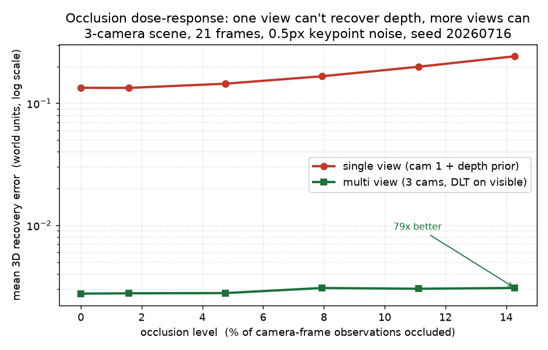

# multicam-occlusion

[](https://github.com/bamdadd/multicam-occlusion/actions/workflows/ci.yml)
[](LICENSE)

📄 **Writeup:** [docs/note.md](docs/note.md) — the three camera-relationship modes
(triangulate / handoff / fusion), methods, and full results in one place.

> **Under occlusion, multi-view keeps 3D pose error about 20x below a single view.
> But that flat error curve is survivorship: as more joints get occluded, multi-view
> quietly stops solving the hard ones. The coverage panel is where that shows up.**



A COCO-17 skeleton stands in a 3-camera ring while a hand sweeps across one camera,
so different joints occlude at different times. The x-axis is the occlusion dose
`phi`, the mean over every (joint, camera) of `1 - visible_fraction` (multicam-sim's
analytic image-space label; no renderer in the loop). Two estimators run per joint:

- **multi-view**: DLT over that joint's visible cameras (>= 2).
- **single-view**: each joint's *own best camera* (highest mean `visible_fraction`),
  back-projected to that joint's centroid-depth prior. This is per-joint-fair, not one
  global worst camera, so the gap is real geometry rather than a strawman.

**Left panel, accuracy.** On joints both can solve, multi-view error is flat and low
(about 0.006 to 0.008 world units) across the whole dose. Single-view starts level with
it at the lowest dose, then climbs to 0.05 to 0.15 once occlusion sets in, roughly 7x to
24x worse. One pixel fixes only a ray, and its depth is unobservable, so single-view
degrades the moment its best camera loses the joint.

**Right panel, coverage (the honesty gate).** The flat multi-view error is partly
survivorship: `multi_mpjpe` averages only joints with >= 2 visible cameras, and that
recoverable fraction falls from **0.94 to 0.73** as the dose rises. The hand is a
physical solid between the subject and the cameras, so it blocks more than one
sightline at once, and single-view coverage falls almost identically (0.94 to 0.73).
So the multi-view advantage here is per-joint accuracy, not coverage: both estimators
lose roughly the same hard joints.

The gap opens with occlusion rather than sitting there from the start. At the lowest
dose the two are a near-tie (0.0060 single vs 0.0061 multi, single marginally better);
multi-view pulls ~20x ahead only as occlusion rises and single-view's depth-blindness
compounds. The honest caveat is not a narrowing gap, it is the dropped joints hidden
behind multi-view's flat curve.

## Results

Mean +/- std over 3 seeds (`{0, 1, 2}`, seeded 1.0px keypoint noise on the
triangulated pixels; visibility and dose are geometric, so coverage carries no seed
spread). Error columns are on recoverable joints only, and are meaningless without the
coverage columns beside them.

| dose `phi` | frames | cover multi | cover single | multi err | single err |
| ---------: | -----: | ----------: | -----------: | --------: | ---------: |
|      0.075 |      1 |        0.94 |         0.94 | 0.0061 +/- 0.0009 | 0.0060 +/- 0.0001 |
|      0.125 |      3 |        0.90 |         0.92 | 0.0065 +/- 0.0003 | 0.0462 +/- 0.0001 |
|      0.175 |      7 |        0.86 |         0.86 | 0.0068 +/- 0.0002 | 0.0660 +/- 0.0001 |
|      0.225 |      8 |        0.77 |         0.79 | 0.0068 +/- 0.0002 | 0.1282 +/- 0.0000 |
|      0.275 |     10 |        0.74 |         0.74 | 0.0071 +/- 0.0003 | 0.1457 +/- 0.0001 |
|      0.325 |     12 |        0.73 |         0.73 | 0.0076 +/- 0.0002 | 0.0679 +/- 0.0001 |

The single-view column is non-monotone and dips at the highest dose (0.146 to 0.068):
at high occlusion more of single-view's best-camera views are lost, so it falls back to
the centroid prior for those joints, and that prior is closer for low-motion joints,
which drags the mean down. That is an honest quirk of the monocular baseline, reported
rather than hidden.

**What the finding is.** Multi-view wins on per-joint accuracy by a wide, depth-driven
margin that does not narrow under occlusion. Its familiar "flat under occlusion" story
is real only on the joints it can still triangulate; the coverage panel shows it giving
up about a quarter of the joints at the highest dose, and single-view gives up the same
ones. Coverage, not per-joint error, is the axis where a physical occluder actually
bites, and it bites both estimators together.

**Reproduce** (drives the [multicam-sim](https://github.com/bamdadd/multicam-sim)
producer, runs the numpy-only recovery over 3 seeds, redraws the two-panel figure):

```bash
./reproduce.sh                  # or: make demo
```

*Deterministic: fixed seeds and geometry, no RNG in the scene, no wall-clock. Generated
on Apple Silicon (arm64), macOS 15, Python 3.13 / NumPy 2.5, no GPU, in about 0.8s. CI
(Python 3.11) does not rerun the sweep; it replays the committed
`tests/fixtures/pose/manifest.json` and asserts the honest relationship (multi more
accurate on recoverable joints, coverage falling with dose, single-view coverage
tracking it) with no extra dependencies.*

---

> **How much does a second or third camera actually buy you when an object is
> occluded in one view?**

When a point is hidden in one camera, a single view can never recover its 3D
position — one image constrains the point only to a viewing ray, so its depth
is unobservable. Add a second calibrated camera and the rays intersect: the
point is recovered exactly. Add more, and the estimate stops caring that any one
view was lost to occlusion. **This benchmark measures that trade-off** — how
single-view recovery fails, how multi-view recovery succeeds, and how recovery
error under realistic pixel noise falls as you add cameras.


*With 0.5px Gaussian pixel noise: more cameras over-determine the triangulation
and drive error down, and the cost of losing one view to occlusion (dashed)
shrinks toward zero as the ring grows. Regenerate with
`uv run python docs/plot_recovery_vs_views.py`.*

## Hero: single view fails, multi-view recovers the occluded point

Project one known 3D point into six synthetic ring cameras, occlude it in three
of them, and triangulate from the surviving views (`uv run python
examples/hero_demo.py`, **exact synthetic geometry, no pixel noise**):

```
ground truth point : [ 0.3 -0.4  0.8]
visible views      : [1, 4, 5] (3 of 6)
single view        : REFUSED -- need >= 2 visible views to triangulate
multi-view recovery: [ 0.3 -0.4  0.8]
max abs error      : 3.33e-16
```

A single view is *refused* — it cannot recover depth. Three surviving views
recover the occluded point to **machine precision (~3e-16)**. The figure above
shows what happens once you add realistic pixel noise: recovery is no longer
exact, and every extra camera measurably tightens it.

## Quickstart

Requires [uv](https://docs.astral.sh/uv/). The core is Blender-free and depends
only on NumPy.

```bash
uv sync                                   # install core + dev tools (numpy only)
uv run pytest -q                          # passing tests, incl. the dose-response
uv run python examples/hero_demo.py       # print the hero block below
```

The dose-response numbers run on a committed fixture with **no extra
dependencies** — `pytest` recovers the real analytic manifest under
`tests/fixtures/pose/manifest.json`. Regenerating the sweep or the figures is optional:

```bash
./reproduce.sh                            # sweep (needs multicam-sim) + redraw figure
uv run --group docs python docs/plot_recovery_vs_views.py   # the vs-views figure
```

Triangulate a point yourself:

```python
import numpy as np
from multicam_occlusion import build_ring_cameras, project_points, triangulate_dlt

cams = build_ring_cameras(n_cameras=6)                 # (6, 3, 4) projection matrices
gt = np.array([0.3, -0.4, 0.8])
pts = np.vstack([project_points(p, gt)[0] for p in cams])

mask = np.ones(6, dtype=bool)
mask[[0, 2, 5]] = False                                # occlude 3 views
print(triangulate_dlt(cams, pts, mask=mask))           # ~[0.3, -0.4, 0.8]
```

## What runs today vs what's planned

**Runs today** — a self-contained, deterministic core:

- `build_ring_cameras` — synthetic calibrated pinhole cameras on a ring
  (`P = K[R|t]`, OpenCV convention).
- `triangulate_dlt` — linear Direct Linear Transformation triangulation from any
  subset of visible views; refuses degenerate (<2-view) solves.
- `drop_k_mask` / `occlude` — deterministic, seed-reproducible occlusion masks.
- **`ObservationManifest`** — a typed loader for multicam-sim's *analytic
  observation manifest* (per-frame per-camera `uv` + `visible` + `xyz_gt`),
  distinct from the pixel `FrameSource` seam. It rebuilds `P = K[R|t]` and
  self-checks that every stored pixel reprojects to ~1e-6 px.
- **`recover_pose`** — the pose dose-response pipeline: per joint, mask on `visible`,
  triangulate multi-view, and a per-joint-fair monocular depth-prior baseline, with
  MPJPE-style error vs ground truth (co-reported with coverage). `recover_trajectory`
  is the single-point version.
- The **occlusion dose-response sweep** above (`make demo`), the **hero smoke
  test**, and the **recovery-vs-views figure**, all from real runs.

**Planned (roadmap)** — photorealistic scene generation:

- **Kubric/Blender N-camera occlusion scenes**: a camera ring around rendered
  scenes with controllable occluders and per-view visibility masks, so the
  metric runs on rendered imagery instead of exact projections.
- Robust / RANSAC triangulation for outlier observations.
- Sweeping camera *count* (not just occlusion level) and >1 occluded camera on
  larger rings, with an aggregated multi-axis report and a CI artifact.

These are tracked as [good first issues](https://github.com/bamdadd/multicam-occlusion/issues).
See [DESIGN.md](DESIGN.md) for the full benchmark design and evaluation protocol.

## Three camera-relationship modes

Multiple cameras relate to one event in three geometric regimes; the divider is
**view overlap**. Each is a separate, typed, open-closed mode over the same
`multicam-sim` analytic manifest — complementary, not competing. **All three now
run on real `multicam-sim` producer output**, each committed as a numpy-only
fixture so CI never imports the sim.

- **Triangulate** (overlapping views, *the hero above*) — recover 3D pose from the
  cameras that still see each joint under occlusion. Real 3-camera hand-sweep over a
  COCO-17 skeleton: multi-view stays ~20x more accurate on recoverable joints, but its
  flat error curve is survivorship (coverage falls 0.94 to 0.73 with the dose, and
  single-view coverage tracks it). `triangulation.py` / `recovery.py`.
- **Handoff / MTMC** (non-overlapping views, a blind gap) — keep one identity as
  an entity crosses between stations. Real non-overlap two-station rig
  (`make mtmc-scene`): handoff **IDF1 1.0 / 0 ID-switches** vs a no-handoff
  baseline **0.625 / 2**. `mtmc/`, [docs/mtmc-design.md](docs/mtmc-design.md).
- **Fusion** (complementary/asymmetric views) — one camera sees the operator's
  action, another the item/assembly state; fuse them into a joint "who did what
  to which item" and an order-verification status. Real assembly-station scene
  (`make fusion-scene`) with producer-synced operator `actions[]`: association
  **precision = recall = F1 = 1.0** (3 places, lag 0.0 s), all ordered parts
  **fulfilled**. `fusion/`, [docs/fusion-design.md](docs/fusion-design.md).

Framing is domain-neutral (assembly / order fulfilment) so it reads across
warehouse, manufacturing, and logistics. Perfect identity and association scores
are a property of a controllable benchmark with exact ground truth, not a claim
of real-world SOTA; the harder-regime knobs (detector noise, longer gaps,
appearance ambiguity) are tracked as open issues
([#22](https://github.com/bamdadd/multicam-occlusion/issues/22),
[#23](https://github.com/bamdadd/multicam-occlusion/issues/23),
[#24](https://github.com/bamdadd/multicam-occlusion/issues/24)). The full
three-mode writeup — methods, results table, and limitations — is in
[docs/note.md](docs/note.md).

## Method & references

Uses only public multi-view-geometry methods:

- Hartley & Zisserman, *Multiple View Geometry in Computer Vision*, 2nd ed. —
  the DLT and Chapter 12 triangulation.
- [Kubric](https://github.com/google-research/kubric) — planned synthetic scene
  generation.

## License

Apache-2.0 — see [LICENSE](LICENSE).
